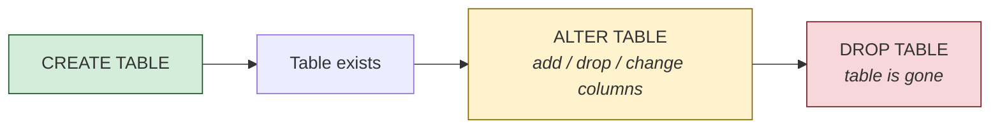
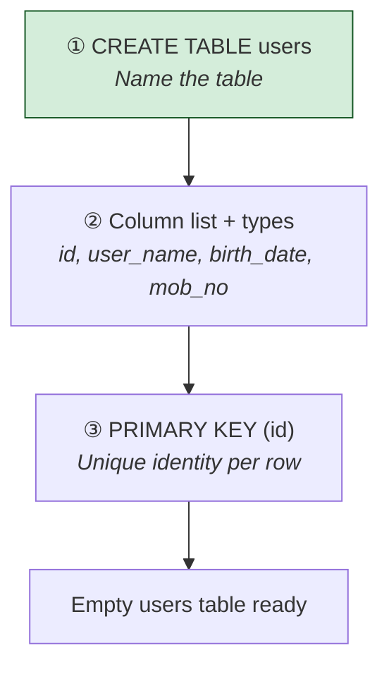
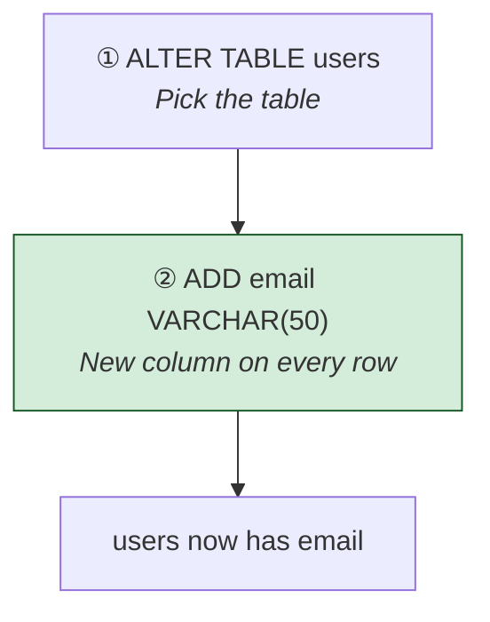
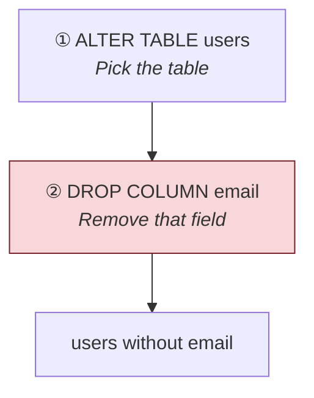
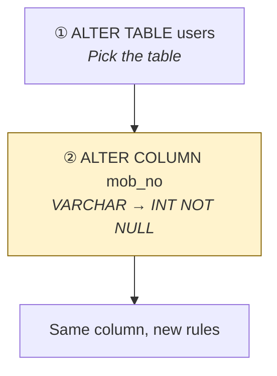
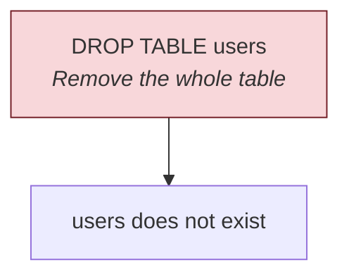

# Create, alter, and drop tables

[← All topics](../README.md)

DDL (Data Definition Language) changes the **shape** of the database — tables and columns — not the rows inside them. This folder covers `CREATE TABLE`, `ALTER TABLE` (add / drop / change a column), and `DROP TABLE`.

---

## Visual cheat sheet — DDL vs DML

`SELECT` **reads** rows. `INSERT` / `UPDATE` / `DELETE` **change** rows. DDL **builds and rebuilds the container**.

| Term | Short definition |
| --- | --- |
| DDL | Data Definition Language — create, change, or remove **objects** (tables, columns) |
| DML | Data Manipulation Language — insert, update, delete **rows** |
| Table | Named box of columns; each row is one record |
| Column | One field on every row (`id`, `user_name`, `email`) |
| Constraint | A rule the table must obey (`PRIMARY KEY`, `NOT NULL`) |

**Memory hook:** DDL = **D**efine the layout. DML = **D**o things to the data.



---

## Visual cheat sheet — `CREATE TABLE`

`CREATE TABLE` **makes a new empty table**. You list each column, its data type, and any rules.

| Term | Short definition |
| --- | --- |
| `CREATE TABLE name` | New table called `name` |
| `INT` | Whole number |
| `VARCHAR(n)` | Text, up to **n** characters |
| `DATE` | A calendar date |
| `NOT NULL` | This column must have a value |
| `PRIMARY KEY` | Unique id for each row — no duplicates, no NULLs |
| `CONSTRAINT pk_users` | Named rule (`pk_users`) so you can refer to it later |

### What you type (from `create-alter-drop.sql`)

```sql
CREATE TABLE users (
    id INT NOT NULL,
    user_name VARCHAR(50),
    birth_date DATE,
    mob_no VARCHAR(15),
    CONSTRAINT pk_users PRIMARY KEY (id)
);
```

### What actually happens

```
┌──────────────────────────────────────────────────────────────────┐
│  STEP 1   CREATE TABLE users                                     │
│           ↓  name the new table                                  │
│                                                                  │
│  STEP 2   Define columns                                         │
│           ↓  id, user_name, birth_date, mob_no + types           │
│                                                                  │
│  STEP 3   CONSTRAINT pk_users PRIMARY KEY (id)                   │
│           ↓  id is the unique row identity                       │
│                                                                  │
│  RESULT   Empty table — structure only, no rows yet              │
└──────────────────────────────────────────────────────────────────┘
```

**Memory hook:** `CREATE` = **C**arve out a new box. Types first, data later.



### Table picture — after `CREATE TABLE users`

```
  users (empty)
  ┌────┬───────────┬────────────┬────────┐
  │ id │ user_name │ birth_date │ mob_no │
  └────┴───────────┴────────────┴────────┘
  columns exist                      0 rows
```

### Examples from `create-alter-drop.sql`

| Goal | What to write |
| --- | --- |
| New table | `CREATE TABLE users ( ... )` |
| Integer id that must be present | `id INT NOT NULL` |
| Short text | `user_name VARCHAR(50)` |
| Date of birth | `birth_date DATE` |
| Unique row id | `CONSTRAINT pk_users PRIMARY KEY (id)` |

**Rule:** `CREATE TABLE` answers “what columns exist?” It does not insert people.

---

## Visual cheat sheet — `ALTER TABLE … ADD` (new column)

`ALTER TABLE` **changes an existing table**. `ADD` puts a **new column** on every row.

| Term | Short definition |
| --- | --- |
| `ALTER TABLE name` | Change table `name` (it must already exist) |
| `ADD col type` | New column on the right |
| `NOT NULL` on ADD | Every existing row must get a value — only safe if the table is empty, or you supply a default |

### What you type (reading order)

```sql
ALTER TABLE users          -- ① which table
ADD email VARCHAR(50);     -- ② new column
```

### What actually happens

```
┌──────────────────────────────────────────────────────────────────┐
│  STEP 1   ALTER TABLE users                                      │
│           ↓  lock onto the existing table                        │
│                                                                  │
│  STEP 2   ADD email VARCHAR(50)                                  │
│           ↓  every row now has an email slot  ← NEW COLUMN HERE  │
└──────────────────────────────────────────────────────────────────┘
```

**Memory hook:** `ADD` = **A**ttach a column. The table stays; the shape grows.



### Add picture — `ADD email`

```
  before                         after ADD email
  ┌────┬───────────┬────────┐    ┌────┬───────────┬────────┬───────┐
  │ id │ user_name │ mob_no │    │ id │ user_name │ mob_no │ email │
  └────┴───────────┴────────┘    └────┴───────────┴────────┴───────┘
  4 columns                      5 columns (email is empty / NULL)
```

`ALTER TABLE persons ADD email VARCHAR(50) NOT NULL` is the same idea on `persons`, with a stricter rule: email cannot be missing.

---

## Visual cheat sheet — `ALTER TABLE … DROP COLUMN` (remove column)

`DROP COLUMN` **removes a column** and the values in it. The table remains.

| Term | Short definition |
| --- | --- |
| `DROP COLUMN col` | Delete that column from the table |
| vs `DROP TABLE` | `DROP COLUMN` keeps the table; `DROP TABLE` removes everything |

### What you type (reading order)

```sql
ALTER TABLE users       -- ① which table
DROP COLUMN email;      -- ② which column to remove
```

### What actually happens

```
┌──────────────────────────────────────────────────────────────────┐
│  STEP 1   ALTER TABLE users                                      │
│           ↓  lock onto the table                                 │
│                                                                  │
│  STEP 2   DROP COLUMN email                                      │
│           ↓  email gone from every row  ← COLUMN REMOVED HERE    │
└──────────────────────────────────────────────────────────────────┘
```

**Memory hook:** `DROP COLUMN` = **D**elete **one field**. `DROP TABLE` = delete the **whole box**.



### Drop-column picture — `DROP COLUMN email`

```
  before                              after DROP COLUMN email
  ┌────┬───────────┬────────┬───────┐ ┌────┬───────────┬────────┐
  │ id │ user_name │ mob_no │ email │ │ id │ user_name │ mob_no │
  └────┴───────────┴────────┴───────┘ └────┴───────────┴────────┘
  5 columns                           4 columns (email values gone)
```

`ALTER TABLE persons DROP COLUMN phone` is the same move on `persons`.

`SELECT * FROM users` / `SELECT * FROM persons` after an alter is **not** DDL — it is a check: “does the new shape look right?”

---

## Visual cheat sheet — `ALTER COLUMN` (change a column’s type)

`ALTER COLUMN` **rewrites one existing column** — type, length, or `NULL` / `NOT NULL`. No new column. No dropped column.

| Term | Short definition |
| --- | --- |
| `ALTER COLUMN col new_type` | Same column name, new definition |
| `INT NOT NULL` | Whole number, and it must have a value |
| Risk | Existing values must **fit** the new type (`'abc'` cannot become `INT`) |

### What you type (from `create-alter-drop.sql`)

```sql
ALTER TABLE users
ALTER COLUMN mob_no INT NOT NULL;
```

### What actually happens

```
┌──────────────────────────────────────────────────────────────────┐
│  STEP 1   ALTER TABLE users                                      │
│           ↓  lock onto the table                                 │
│                                                                  │
│  STEP 2   ALTER COLUMN mob_no INT NOT NULL                       │
│           ↓  VARCHAR(15) → INT, and NULLs no longer allowed      │
└──────────────────────────────────────────────────────────────────┘
```

**Memory hook:** `ADD` grows. `DROP COLUMN` shrinks. `ALTER COLUMN` **reshapes** the same field.



### Type-change picture — `mob_no VARCHAR(15)` → `INT`

```
  before                         after ALTER COLUMN
  ┌──────────────┐               ┌──────────────┐
  │ mob_no       │               │ mob_no       │
  │ VARCHAR(15)  │    ──────►    │ INT NOT NULL │
  │ '9876543210' │               │ 9876543210   │
  └──────────────┘               └──────────────┘
  text digits                    a number (no quotes)
```

### Three `ALTER` moves (pick one)

| Goal | What to write |
| --- | --- |
| New column | `ALTER TABLE users ADD email VARCHAR(50)` |
| Remove a column | `ALTER TABLE users DROP COLUMN email` |
| Change type / nullability | `ALTER TABLE users ALTER COLUMN mob_no INT NOT NULL` |

**Rule:** `ALTER TABLE` always names the **table** first, then the action (`ADD` / `DROP COLUMN` / `ALTER COLUMN`).

---

## Visual cheat sheet — `DROP TABLE`

`DROP TABLE` **deletes the table** — columns, rows, constraints. There is no undo unless you have a backup.

| Term | Short definition |
| --- | --- |
| `DROP TABLE name` | Remove the table object entirely |
| vs `DELETE FROM` | `DELETE` empties **rows**; the table still exists |
| vs `DROP COLUMN` | One column gone; the table still exists |

### What you type (from `create-alter-drop.sql`)

```sql
DROP TABLE users;
```

### What actually happens

```
┌──────────────────────────────────────────────────────────────────┐
│  STEP 1   DROP TABLE users                                       │
│           ↓  remove the object  ← TABLE GONE                     │
│                                                                  │
│  RESULT   users no longer exists — SELECT * FROM users will fail │
└──────────────────────────────────────────────────────────────────┘
```

**Memory hook:** `CREATE` builds. `ALTER` edits. `DROP` **destroys**.



### Drop-table picture

```
  before DROP TABLE              after DROP TABLE
  ┌────┬───────────┬────────┐    (no users table)
  │ id │ user_name │ mob_no │
  │  1 │ Anna      │  …     │    SELECT * FROM users  →  error
  └────┴───────────┴────────┘
  structure + data gone
```

### `DROP` vs `DELETE` vs `DROP COLUMN`

| Command | What disappears | What remains |
| --- | --- | --- |
| `DROP COLUMN email` | That column | The table and other columns |
| `DELETE FROM users` | All **rows** | The empty table |
| `DROP TABLE users` | The **table** | Nothing named `users` |

---

## Files in this folder

| File | What it covers |
| --- | --- |
| [create-alter-drop.sql](create-alter-drop.sql) | `CREATE TABLE`, `ALTER TABLE` (`ADD`, `DROP COLUMN`, `ALTER COLUMN`), `DROP TABLE` |

---

## Quick reminders

- **`CREATE TABLE name ( col type, ... )`** — new empty table; list columns and types.
- **`CONSTRAINT name PRIMARY KEY (col)`** — unique identity for each row.
- **`ALTER TABLE name ADD col type`** — new column on an existing table.
- **`ALTER TABLE name DROP COLUMN col`** — remove one column; table stays.
- **`ALTER TABLE name ALTER COLUMN col new_type`** — change type or `NOT NULL` on an existing column.
- **`DROP TABLE name`** — delete the table (not the same as `DELETE` rows).
- **`SELECT * FROM name`** after an alter — peek at the new shape; that is DML/query, not DDL.
- **`NOT NULL`** — the column must have a value. Adding `NOT NULL` to a table that already has rows can fail if any row is empty.
- Text types use **`VARCHAR(n)`**. Numbers use **`INT`**. Dates use **`DATE`**.
