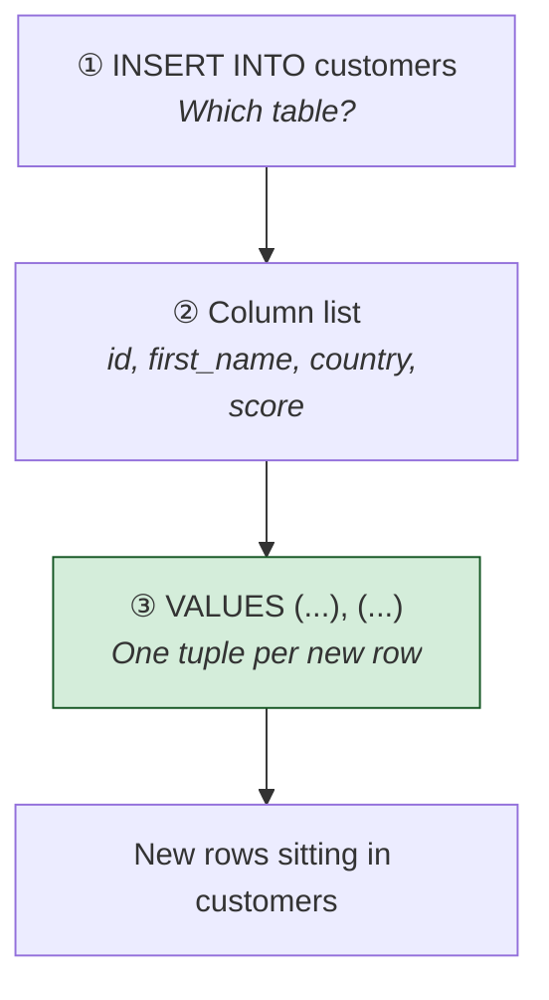
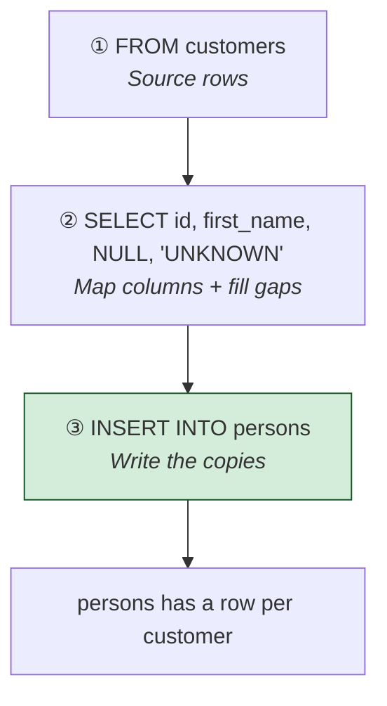
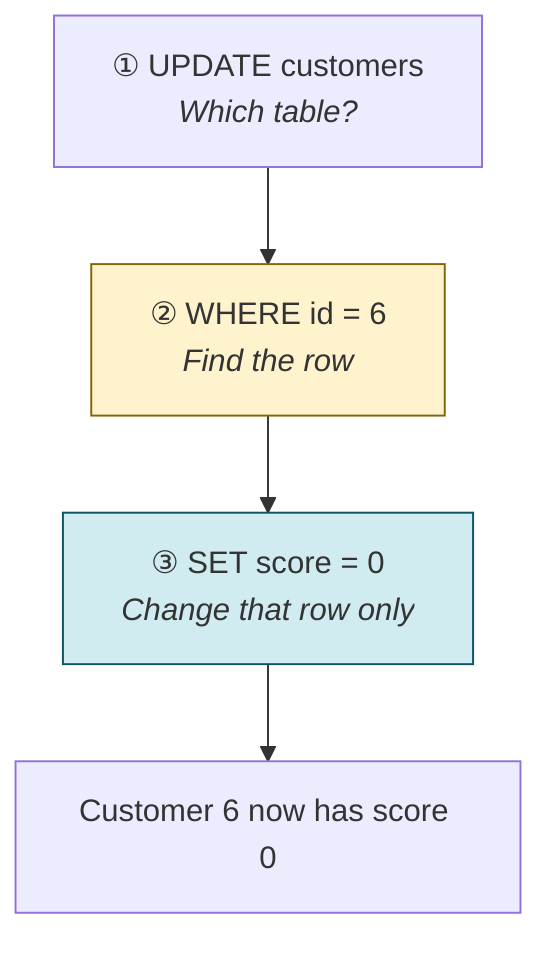
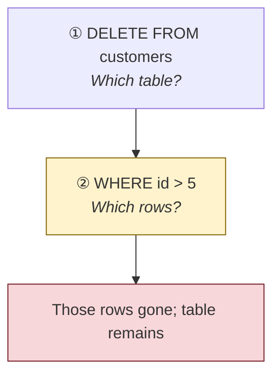
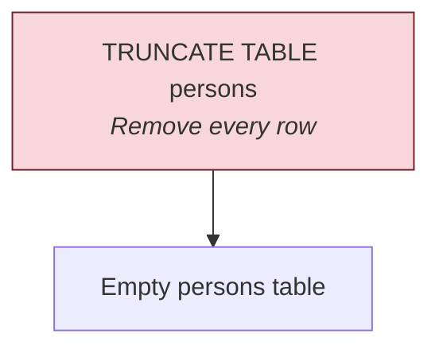

# Insert, update, and delete rows

[← All topics](../README.md)

DML (Data Manipulation Language) changes the **rows** inside a table — add, change, or remove data. The table itself stays. This folder covers `INSERT`, `UPDATE`, `DELETE`, and `TRUNCATE TABLE`.

---

## Visual cheat sheet — DML vs DDL

DDL **builds the box**. DML **puts things in it, relabels them, or takes them out**. `SELECT` only **reads**.

| Term | Short definition |
| --- | --- |
| DML | Data Manipulation Language — insert, update, delete **rows** |
| DDL | Data Definition Language — create, change, or drop **tables / columns** |
| `INSERT` | Add new rows |
| `UPDATE` | Change values on existing rows |
| `DELETE` | Remove matching rows (table remains) |
| `TRUNCATE TABLE` | Empty the table in one shot (all rows gone, table remains) |
| `NULL` | Missing value — not the same as `0` or `''` |

**Memory hook:** DML = **D**o things to the **data**. Always pair `UPDATE` / `DELETE` with `WHERE`.


---

## Visual cheat sheet — `INSERT … VALUES` (new rows)

`INSERT` **adds rows**. You name the table, list the columns, then give a `VALUES` list. One pair of parentheses = one row. Commas between rows add several at once.

| Term | Short definition |
| --- | --- |
| `INSERT INTO table (cols)` | Target table and which columns you are filling |
| `VALUES ( ... )` | One new row |
| Extra `( ... ), ( ... )` | More rows in the same statement |
| `NULL` | Leave that column empty |

Column order in the list must match the order of values.

### What you type (from `insert-update-delete.sql`)

```sql
INSERT INTO customers (id, first_name, country, score)
VALUES
    (11, 'Raj',  'INDIA', 500),
    (12, 'SAM',  'USA',   NULL);
```

### What actually happens

```
┌──────────────────────────────────────────────────────────────────┐
│  STEP 1   INSERT INTO customers (id, first_name, country, score) │
│           ↓  pick the table and the columns                      │
│                                                                  │
│  STEP 2   VALUES (11, 'Raj', ...), (12, 'SAM', ...)              │
│           ↓  append those rows  ← NEW ROWS HERE                  │
└──────────────────────────────────────────────────────────────────┘
```

**Memory hook:** `INSERT` = **I**ncoming rows. List columns, then values in the **same order**.



### Insert picture — two new customers

```
  before                         after INSERT
  ┌────┬──────┬─────────┬───────┐ ┌────┬──────┬─────────┬───────┐
  │ id │ name │ country │ score │ │ id │ name │ country │ score │
  │  … │  …   │    …    │   …   │ │  … │  …   │    …    │   …   │
  └────┴──────┴─────────┴───────┘ │ 11 │ Raj  │ INDIA   │   500 │
                                  │ 12 │ SAM  │ USA     │  NULL │
                                  └────┴──────┴─────────┴───────┘
  existing rows kept              two rows appended
```

### Partial insert — only some columns

If you omit a column, SQL Server fills it with `NULL` (or a default, if the table has one).

```sql
INSERT INTO customers (id, first_name)
VALUES (14, 'Manish');
```

```
  INSERT (id, first_name) only
  ┌────┬────────┬─────────┬───────┐
  │ 14 │ Manish │  NULL   │  NULL │
  └────┴────────┴─────────┴───────┘
  country and score were not listed → NULL
```

### Examples from `insert-update-delete.sql`

| Goal | What to write |
| --- | --- |
| Several full rows | `INSERT INTO customers (id, first_name, country, score) VALUES (...), (...)` |
| Score unknown | Put `NULL` in that slot |
| Only id and name | `INSERT INTO customers (id, first_name) VALUES (14, 'Manish')` |

**Rule:** every value list must match the column list. Text in **single quotes**. Numbers and `NULL` without quotes.

---

## Visual cheat sheet — `INSERT … SELECT` (copy rows)

Instead of typing `VALUES`, you can **feed `INSERT` with a query**. Source rows become new rows in the target.

| Term | Short definition |
| --- | --- |
| `INSERT INTO target (cols)` | Where the copies land |
| `SELECT … FROM source` | Where the values come from |
| Literal in `SELECT` | Same value on every copied row (`NULL`, `'UNKNOWN'`) |

The `SELECT` list must match the `INSERT` column list — same count, compatible types.

### What you type (from `insert-update-delete.sql`)

```sql
INSERT INTO persons (id, person_name, birth_date, email)
SELECT
    id,
    first_name,
    NULL,
    'UNKNOWN'
FROM customers;
```

### What actually happens

```
┌──────────────────────────────────────────────────────────────────┐
│  STEP 1   SELECT id, first_name, NULL, 'UNKNOWN' FROM customers  │
│           ↓  build a result set (one row per customer)           │
│                                                                  │
│  STEP 2   INSERT INTO persons (id, person_name, birth_date, email)│
│           ↓  write those rows into persons  ← COPY HERE          │
└──────────────────────────────────────────────────────────────────┘
```

**Memory hook:** `VALUES` = you type the rows. `SELECT` = the **table** supplies the rows.



### Copy picture — customers → persons

```
  customers                      persons (after INSERT…SELECT)
  ┌────┬───────────┐             ┌────┬─────────────┬────────────┬─────────┐
  │ id │ first_name│             │ id │ person_name │ birth_date │ email   │
  │ 11 │ Raj       │   ──────►   │ 11 │ Raj         │    NULL    │ UNKNOWN │
  │ 12 │ SAM       │             │ 12 │ SAM         │    NULL    │ UNKNOWN │
  └────┴───────────┘             └────┴─────────────┴────────────┴─────────┘
  source kept                    copies; birth_date and email filled in
```

`id` and `first_name` come from `customers`. `birth_date` is `NULL` on every copy. `email` is `'UNKNOWN'` on every copy.

**Rule:** source table is not emptied. You **copy**, you do not move.

---

## Visual cheat sheet — `UPDATE` (change existing rows)

`UPDATE` **rewrites values** on rows that already exist. `SET` says what to change. `WHERE` says **which rows**.

| Term | Short definition |
| --- | --- |
| `UPDATE table` | Which table to change |
| `SET col = value` | New value for that column |
| Extra `col = value` | Change several columns in one statement |
| `WHERE condition` | Limit which rows are touched |
| `IS NULL` | Test for a missing value (`score = NULL` does **not** work) |

**Habit:** never run `UPDATE` without `WHERE` unless you truly mean **every row**.

### What you type (reading order)

```sql
UPDATE customers     -- ① which table
SET score = 0        -- ② what to change
WHERE id = 6;        -- ③ which row
```

### What actually happens

```
┌──────────────────────────────────────────────────────────────────┐
│  STEP 1   UPDATE customers                                       │
│           ↓  lock onto the table                                 │
│                                                                  │
│  STEP 2   WHERE id = 6                                           │
│           ↓  find matching rows  ← FILTER HERE                   │
│                                                                  │
│  STEP 3   SET score = 0                                          │
│           ↓  write the new value on those rows only              │
└──────────────────────────────────────────────────────────────────┘
```

**Memory hook:** `SET` = **S**wap the value. `WHERE` = **W**hich rows. No `WHERE` → **W**hole table.



### Update picture — `SET score = 0 WHERE id = 6`

```
  before                         after
  ┌────┬───────┐                 ┌────┬───────┐
  │  5 │    85 │                 │  5 │    85 │  ← untouched
  │  6 │   100 │      ──────►    │  6 │     0 │  ← changed
  │  7 │    42 │                 │  7 │    42 │  ← untouched
  └────┴───────┘                 └────┴───────┘
```

### Several columns at once

```sql
UPDATE customers
SET score = 0,
    country = 'UK'
WHERE id = 10;
```

One `WHERE`, two assignments. Customer 10 gets both a new score and a new country.

### Fill nulls — `WHERE score IS NULL`

```sql
UPDATE customers
SET score = 0
WHERE score IS NULL;
```

```
  before                    WHERE score IS NULL         SET score = 0
  ┌────┬───────┐            ┌────┬───────┐              ┌────┬───────┐
  │ 11 │   500 │            │ 12 │  NULL │ ✓            │ 11 │   500 │
  │ 12 │  NULL │   ──────►  │ 14 │  NULL │ ✓   ──────►  │ 12 │     0 │
  │ 14 │  NULL │            └────┴───────┘              │ 14 │     0 │
  └────┴───────┘            500-score row skipped       └────┴───────┘
```

`IS NULL` is the test for “missing.” `score = NULL` never matches.

### Examples from `insert-update-delete.sql`

| Goal | What to write |
| --- | --- |
| Customer 6’s score → 0 | `UPDATE customers SET score = 0 WHERE id = 6` |
| Customer 10: score and country | `SET score = 0, country = 'UK' WHERE id = 10` |
| Every missing score → 0 | `SET score = 0 WHERE score IS NULL` |

**Rule:** `UPDATE` answers “change what, on which rows?” Without `WHERE`, every row gets the new value.

---

## Visual cheat sheet — `DELETE` (remove rows)

`DELETE` **removes matching rows**. Columns stay. The table stays. Other rows stay.

| Term | Short definition |
| --- | --- |
| `DELETE FROM table` | Remove rows from `table` |
| `WHERE condition` | Which rows to remove |
| vs `DROP TABLE` | `DELETE` keeps the table; `DROP TABLE` removes the object |
| vs `TRUNCATE TABLE` | `TRUNCATE` removes **all** rows, faster, no `WHERE` |

**Habit:** always use `WHERE` on `DELETE` unless you mean to empty the table.

### What you type (from `insert-update-delete.sql`)

```sql
DELETE FROM customers
WHERE id > 5;
```

### What actually happens

```
┌──────────────────────────────────────────────────────────────────┐
│  STEP 1   DELETE FROM customers                                  │
│           ↓  lock onto the table                                 │
│                                                                  │
│  STEP 2   WHERE id > 5                                           │
│           ↓  keep id 1–5; drop the rest  ← ROWS REMOVED HERE     │
└──────────────────────────────────────────────────────────────────┘
```

**Memory hook:** `DELETE` = **D**rop **rows**. `DROP TABLE` = drop the **table**.



### Delete picture — `WHERE id > 5`

```
  before                         after DELETE
  ┌────┬──────┐                  ┌────┬──────┐
  │  4 │ Anna │                  │  4 │ Anna │  ← kept
  │  5 │ Ben  │       ──────►    │  5 │ Ben  │  ← kept
  │  6 │ Cara │                  └────┴──────┘
  │ 11 │ Raj  │                  6 and 11 gone
  └────┴──────┘
```

`SELECT * FROM customers` / `SELECT * FROM persons` after DML is a **check**, not a change — same idea as after `ALTER`.

---

## Visual cheat sheet — `TRUNCATE TABLE` (empty the table)

`TRUNCATE TABLE` **wipes every row** and keeps the table structure. You cannot add `WHERE`.

| Term | Short definition |
| --- | --- |
| `TRUNCATE TABLE name` | All rows gone; columns and constraints remain |
| No `WHERE` | All or nothing |
| vs `DELETE` with no `WHERE` | Both empty the table; `TRUNCATE` is a bulk reset (identity restarts on most tables) |

### What you type (from `insert-update-delete.sql`)

```sql
TRUNCATE TABLE persons;
```

### What actually happens

```
┌──────────────────────────────────────────────────────────────────┐
│  STEP 1   TRUNCATE TABLE persons                                 │
│           ↓  remove all rows  ← TABLE EMPTIED                    │
│                                                                  │
│  RESULT   persons still exists — 0 rows                          │
└──────────────────────────────────────────────────────────────────┘
```

**Memory hook:** `TRUNCATE` = **T**oss **all** rows. Table skeleton stays.



### Truncate picture

```
  before TRUNCATE                after TRUNCATE
  ┌────┬─────────────┬─────────┐ ┌────┬─────────────┬─────────┐
  │ 11 │ Raj         │ UNKNOWN │ │    │             │         │
  │ 12 │ SAM         │ UNKNOWN │ └────┴─────────────┴─────────┘
  └────┴─────────────┴─────────┘ 0 rows; columns still there
```

### `DELETE` vs `TRUNCATE` vs `DROP TABLE`

| Command | What disappears | What remains | Can use `WHERE`? |
| --- | --- | --- | --- |
| `DELETE FROM customers WHERE id > 5` | Matching **rows** | Table + other rows | Yes |
| `TRUNCATE TABLE persons` | **All rows** | Empty table | No |
| `DROP TABLE persons` | The **table** | Nothing named `persons` | No |

---

## Files in this folder

| File | What it covers |
| --- | --- |
| [insert-update-delete.sql](insert-update-delete.sql) | `INSERT` (`VALUES` and `SELECT`), `UPDATE`, `DELETE`, `TRUNCATE TABLE` |

---

## Quick reminders

- **`INSERT INTO table (cols) VALUES (...)`** — add rows; extra `(...)` lists add more rows.
- **Partial insert** — omitted columns become `NULL` (or the column default).
- **`INSERT INTO target (cols) SELECT … FROM source`** — copy rows; source is unchanged.
- **`UPDATE table SET col = value WHERE condition`** — change existing rows. No `WHERE` updates **every** row.
- **Several columns** — `SET score = 0, country = 'UK'` in one `UPDATE`.
- **`WHERE score IS NULL`** — find missing values. Do not write `score = NULL`.
- **`DELETE FROM table WHERE condition`** — remove matching rows. Always use `WHERE` unless you mean all rows.
- **`TRUNCATE TABLE name`** — empty the table; no `WHERE`; table structure stays.
- **`SELECT *`** after a change — peek at the result; that is a read, not DML.
- Text in **single quotes** (`'Raj'`, `'UK'`). Numbers and `NULL` without quotes.
