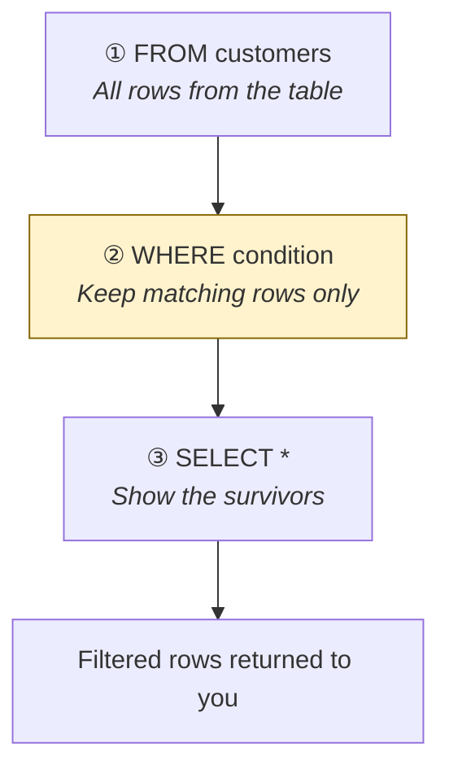
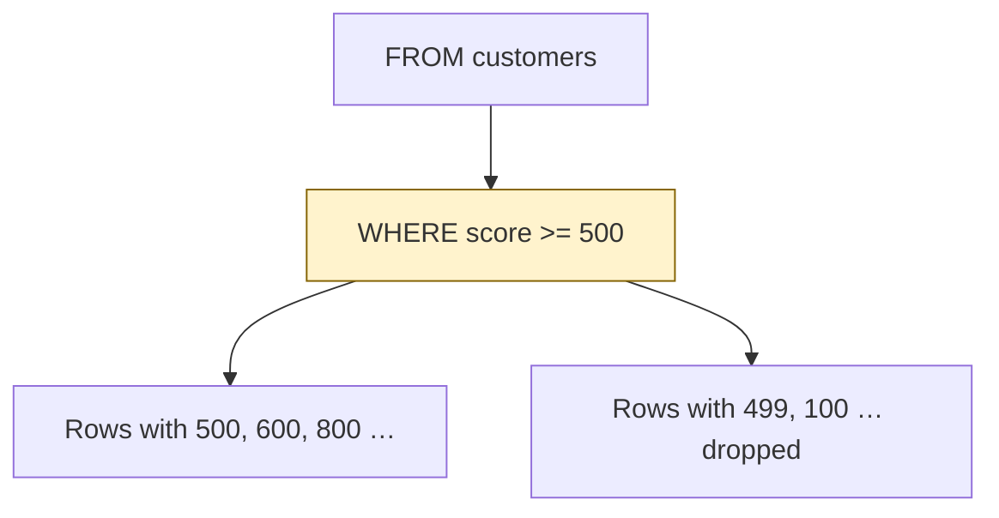
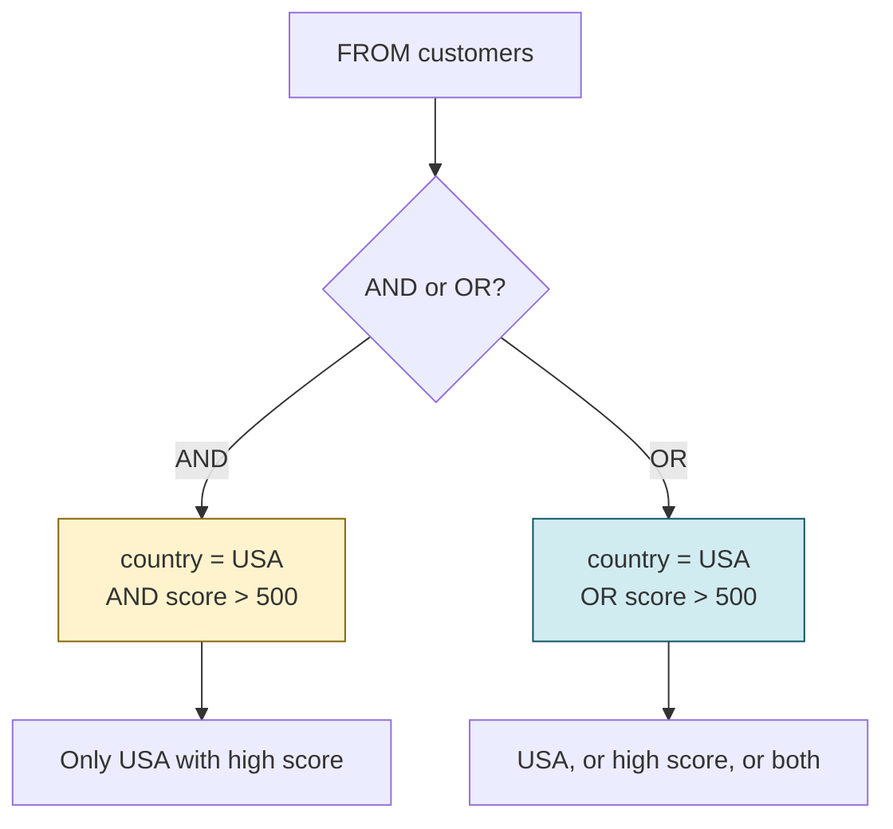
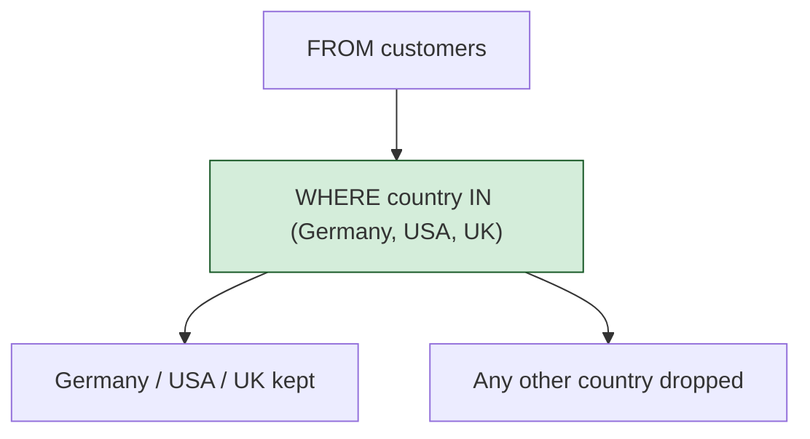
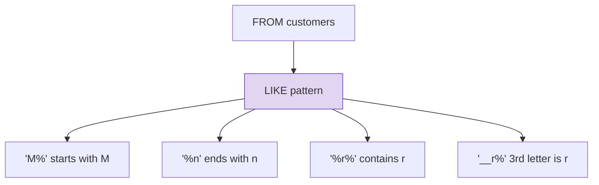

# Filter rows with WHERE

[← All topics](../README.md)

`WHERE` **keeps or drops rows** before SQL Server builds the result. This folder covers comparison operators (`=`, `!=`, `>`, `>=`, `<`, `<=`), logical operators (`AND`, `OR`, `NOT`), ranges (`BETWEEN`), lists (`IN`), and text patterns (`LIKE`).

---

## Visual cheat sheet — `WHERE` (the gate)

Every row from the table must pass the condition, or it is dropped. `WHERE` runs **after** `FROM` and **before** `SELECT`.

| Term | Short definition |
| --- | --- |
| `WHERE condition` | Keep only rows that make the condition **true** |
| Comparison | Compare one column to a value (`=`, `!=`, `>`, `>=`, `<`, `<=`) |
| Logical | Combine tests (`AND`, `OR`, `NOT`) |
| Range | Inclusive low–high (`BETWEEN`) |
| Membership | Value is in a list (`IN`) |
| Pattern | Text match with wildcards (`LIKE`) |

**Memory hook:** **F**rom → **W**here → **S**elect → **FWS**. Filter in the middle.



```
  customers table          WHERE country = 'USA'         SELECT *
  ┌─────────┬───────┐      ┌─────────┬───────┐           ┌─────────┬───────┐
  │ USA     │   500 │ ✓    │ USA     │   500 │           │ USA     │   500 │
  │ Germany │    85 │ ✗    │ USA     │   100 │           │ USA     │   100 │
  │ USA     │   100 │ ✓    └─────────┴───────┘           └─────────┴───────┘
  └─────────┴───────┘      Germany dropped
```

**Rule:** numbers without quotes (`500`). Text with **single quotes** (`'USA'`).

---

## Visual cheat sheet — comparison operators

A comparison asks one question of one column. The row stays only if the answer is true.

| Operator | Meaning | Example from `filtering-data.sql` |
| --- | --- | --- |
| `=` | equal to | `WHERE country = 'USA'` |
| `!=` or `<>` | not equal to | `WHERE country != 'USA'` |
| `>` | greater than | `WHERE score > 600` |
| `>=` | greater than or equal | `WHERE score >= 500` |
| `<` | less than | `WHERE score < 800` |
| `<=` | less than or equal | `WHERE score <= 500` |

### What you type (reading order)

```sql
SELECT *                    -- ① you write this first
FROM customers              -- ②
WHERE score >= 500;         -- ③ the test
```

### What actually happens

```
┌──────────────────────────────────────────────────────────────────┐
│  STEP 1   FROM customers                                         │
│           ↓  load rows                                           │
│                                                                  │
│  STEP 2   WHERE score >= 500                                     │
│           ↓  keep scores 500 and up  ← FILTER HERE               │
│                                                                  │
│  STEP 3   SELECT *                                               │
│           ↓  show those rows                                     │
└──────────────────────────────────────────────────────────────────┘
```

**Memory hook:** `=` is exact. `>` is **strict** (600 is out of `>= 500`? No — 600 stays. 499 is out). `>=` / `<=` **include** the edge.



### Comparison picture — `score >= 500` vs `score > 600`

```
  scores     = 'USA'   != 'USA'   > 600   >= 500   < 800   <= 500
  400          —         ✓          ✗       ✗        ✓       ✓
  500          —         ✓          ✗       ✓        ✓       ✓
  600          —         ✓          ✗       ✓        ✓       ✗
  800          —         ✓          ✓       ✓        ✗       ✗
```

`country = 'USA'` keeps only USA. `country != 'USA'` keeps everyone else.

### Examples from `filtering-data.sql`

| Goal | Condition |
| --- | --- |
| From the USA | `WHERE country = 'USA'` |
| Not from the USA | `WHERE country != 'USA'` |
| Score above 600 | `WHERE score > 600` |
| Score 500 or more | `WHERE score >= 500` |
| Score below 800 | `WHERE score < 800` |
| Score 500 or less | `WHERE score <= 500` |

**Rule:** `>` / `<` skip the boundary. `>=` / `<=` include it.

---

## Visual cheat sheet — `AND` / `OR` / `NOT`

Logical operators **combine** tests. Each comparison is still true or false; the combinator decides how many must pass.

| Term | Short definition |
| --- | --- |
| `AND` | **Both** (all) conditions must be true |
| `OR` | **At least one** condition must be true |
| `NOT` | Flip the test — true becomes false, false becomes true |

### `AND` — both must pass

```sql
SELECT *
FROM customers
WHERE country = 'USA' AND score > 500;
```

```
  country    score     USA?    score > 500?    AND
  USA          600      ✓           ✓          ✓  keep
  USA          100      ✓           ✗          ✗  drop
  Germany      800      ✗           ✓          ✗  drop
```

**Memory hook:** `AND` is a **narrow** gate — two keys, both needed.

### `OR` — one pass is enough

```sql
SELECT *
FROM customers
WHERE country = 'USA' OR score > 500;
```

```
  country    score     USA?    score > 500?    OR
  USA          600      ✓           ✓          ✓  keep
  USA          100      ✓           ✗          ✓  keep (USA)
  Germany      800      ✗           ✓          ✓  keep (score)
  Germany      100      ✗           ✗          ✗  drop
```

**Memory hook:** `OR` is a **wide** gate — either key opens it.



### `NOT` — reverse the test

```sql
SELECT *
FROM customers
WHERE NOT score >= 500;
```

`score >= 500` keeps 500 and up. `NOT` flips that → keep scores **below** 500 (same as `score < 500`).

```
  score     score >= 500     NOT score >= 500
  400            ✗                  ✓  keep
  500            ✓                  ✗  drop
  800            ✓                  ✗  drop
```

**Memory hook:** `NOT` = **N**egate. Prefer the simple form when you can (`score < 500` instead of `NOT score >= 500`).

### Examples from `filtering-data.sql`

| Goal | What to write |
| --- | --- |
| USA **and** score above 500 | `WHERE country = 'USA' AND score > 500` |
| USA **or** score above 500 | `WHERE country = 'USA' OR score > 500` |
| Score is **not** 500 or more | `WHERE NOT score >= 500` |

**Rule:** `AND` shrinks the result. `OR` grows it. `NOT` flips one test.

---

## Visual cheat sheet — `BETWEEN` (inclusive range)

`BETWEEN` keeps values from the **low** bound to the **high** bound, **including both ends**. It is the same as `>= AND <=`.

| Term | Short definition |
| --- | --- |
| `BETWEEN low AND high` | `col >= low AND col <= high` |
| Inclusive | 100 and 500 both stay |
| Order | Write **low then high** (`BETWEEN 500 AND 100` matches nothing useful) |

### What you type (from `filtering-data.sql`)

```sql
SELECT *
FROM customers
WHERE score BETWEEN 100 AND 500;
```

Same filter, spelled with comparisons:

```sql
SELECT *
FROM customers
WHERE score >= 100 AND score <= 500;
```

### What actually happens

```
┌──────────────────────────────────────────────────────────────────┐
│  STEP 1   FROM customers                                         │
│                                                                  │
│  STEP 2   WHERE score BETWEEN 100 AND 500                        │
│           ↓  keep 100, 250, 500 — drop 99 and 501                │
└──────────────────────────────────────────────────────────────────┘
```

**Memory hook:** `BETWEEN` = **B**oth ends **in**. Low **AND** high.

```
  score     BETWEEN 100 AND 500     >= 100 AND <= 500
   50              ✗                       ✗
  100              ✓                       ✓
  300              ✓                       ✓
  500              ✓                       ✓
  800              ✗                       ✗
```

**Rule:** `BETWEEN` is a shortcut for two comparisons. Either form is the same gate.

---

## Visual cheat sheet — `IN` (membership list)

`IN` asks: is this column’s value **one of these**? It replaces a chain of `OR`s on the **same column**.

| Term | Short definition |
| --- | --- |
| `IN (a, b, c)` | Value equals `a` **or** `b` **or** `c` |
| Same column | Use `IN` when every test is `country = …` |
| Different tests | Stay with `AND` / `OR` (`country = 'USA' OR score > 500`) |

### What you type (from `filtering-data.sql`)

Long form:

```sql
SELECT *
FROM customers
WHERE country = 'Germany'
   OR country = 'USA'
   OR country = 'UK';
```

Short form — prefer this:

```sql
SELECT *
FROM customers
WHERE country IN ('Germany', 'USA', 'UK');
```

### What actually happens

```
┌──────────────────────────────────────────────────────────────────┐
│  STEP 1   FROM customers                                         │
│                                                                  │
│  STEP 2   WHERE country IN ('Germany', 'USA', 'UK')              │
│           ↓  keep if country is any one of the three             │
└──────────────────────────────────────────────────────────────────┘
```

**Memory hook:** `IN` = **I**s it **N**ear this list? One column, many allowed values.



### List picture — `IN` vs `OR`

```
  country      = Germany OR = USA OR = UK      IN ('Germany','USA','UK')
  Germany                 ✓                              ✓
  USA                     ✓                              ✓
  UK                      ✓                              ✓
  INDIA                   ✗                              ✗
```

### Examples from `filtering-data.sql`

| Goal | What to write |
| --- | --- |
| Germany or USA or UK (`OR`) | `WHERE country = 'Germany' OR country = 'USA' OR country = 'UK'` |
| Same, shorter | `WHERE country IN ('Germany', 'USA', 'UK')` |

**Rule:** same column, several values → `IN`. Two different columns → `AND` / `OR`.

---

## Visual cheat sheet — `LIKE` (text patterns)

`LIKE` matches a **pattern**, not an exact string. Wildcards stand in for unknown characters.

| Wildcard | Meaning |
| --- | --- |
| `%` | Any number of characters (including none) |
| `_` | **Exactly one** character |

| Pattern | Meaning | Example match |
| --- | --- | --- |
| `'M%'` | Starts with M | Maria, Max |
| `'%n'` | Ends with n | Ann, Ben |
| `'%r%'` | Contains r anywhere | Maria, Sara |
| `'__r%'` | Third character is r | Maria (`M-a-r-…`) |

### What you type (from `filtering-data.sql`)

```sql
SELECT *
FROM customers
WHERE first_name LIKE 'M%';      -- starts with M

SELECT *
FROM customers
WHERE first_name LIKE '%n';      -- ends with n

SELECT *
FROM customers
WHERE first_name LIKE '%r%';     -- contains r

SELECT *
FROM customers
WHERE first_name LIKE '__r%';    -- r in 3rd position
```

### What actually happens

```
┌──────────────────────────────────────────────────────────────────┐
│  STEP 1   FROM customers                                         │
│                                                                  │
│  STEP 2   WHERE first_name LIKE 'M%'                             │
│           ↓  keep names that start with M  ← PATTERN HERE        │
└──────────────────────────────────────────────────────────────────┘
```

**Memory hook:** `%` = “the rest, any length.” `_` = “one slot.” Count underscores for position: `__r` = 1st anything, 2nd anything, **3rd = r**.



### Pattern picture

```
  first_name    'M%'     '%n'     '%r%'    '__r%'
  Maria          ✓        ✗        ✓        ✓
  Max            ✓        ✗        ✗        ✗
  Ann            ✗        ✓        ✗        ✗
  Ben            ✗        ✓        ✗        ✗
  Sara           ✗        ✗        ✓        ✓

  Positions:     1    2    3    4
  Maria          M    a    r    i    …     '__r%' → position 3 is r → keep
  Sara           S    a    r    a          '__r%' → position 3 is r → keep
  Ann            A    n    n               '__r%' → position 3 is n → drop
```

`Sara`: S=1, a=2, r=3 → `'__r%'` matches. `Ann` is only three letters and position 3 is `n`, so it fails `'__r%'`.

### Examples from `filtering-data.sql`

| Goal | Pattern |
| --- | --- |
| First name starts with M | `WHERE first_name LIKE 'M%'` |
| First name ends with n | `WHERE first_name LIKE '%n'` |
| First name contains r | `WHERE first_name LIKE '%r%'` |
| r is the 3rd character | `WHERE first_name LIKE '__r%'` |

**Rule:** exact text → `=`. Fuzzy text → `LIKE`. `%` for a chunk, `_` for one character.

---

## Files in this folder

| File | What it covers |
| --- | --- |
| [filtering-data.sql](filtering-data.sql) | Comparison (`=`, `!=`, `>`, `>=`, `<`, `<=`), `AND` / `OR` / `NOT`, `BETWEEN`, `IN`, `LIKE` |

---

## Quick reminders

- **`WHERE condition`** — filter rows after `FROM`, before `SELECT`.
- **`=` `!=` `>` `>=` `<` `<=`** — one column vs one value. `>=` / `<=` include the edge.
- **`AND`** — both tests true (narrower). **`OR`** — at least one true (wider). **`NOT`** — flip a test.
- **`BETWEEN low AND high`** — inclusive range; same as `>= low AND <= high`.
- **`IN ('a', 'b', 'c')`** — same column, several values; shorter than a chain of `OR`s.
- **`LIKE 'M%'`** — starts with M. **`'%n'`** — ends with n. **`'%r%'`** — contains r.
- **`LIKE '__r%'`** — `_` is one character; two underscores put `r` in position 3.
- Text in **single quotes** (`'USA'`, `'M%'`). Numbers without quotes (`500`).
