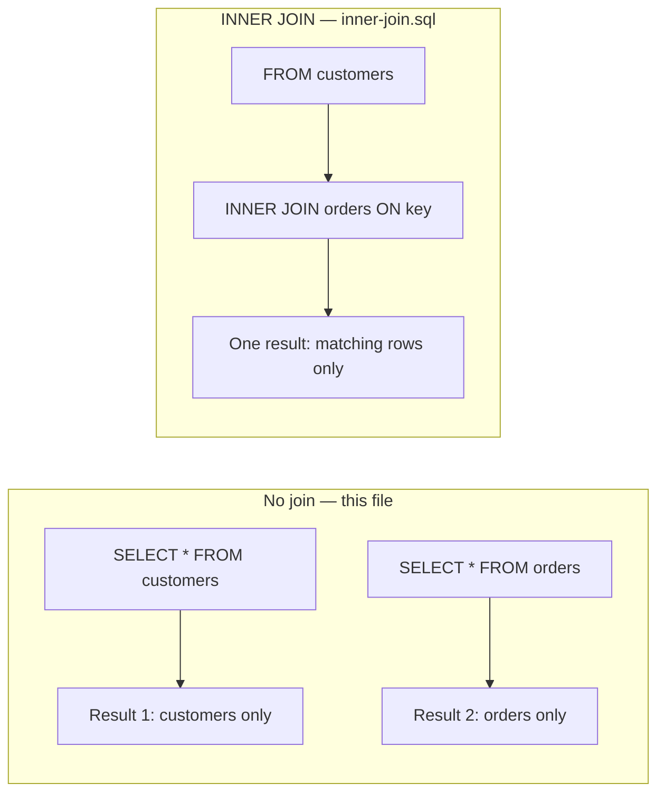
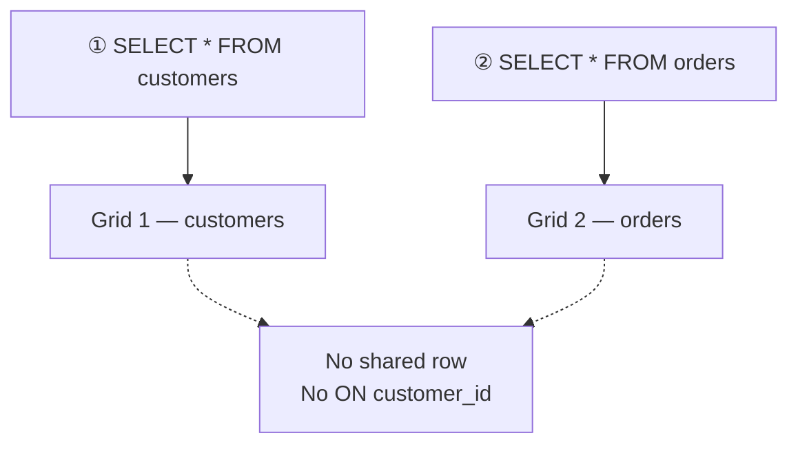
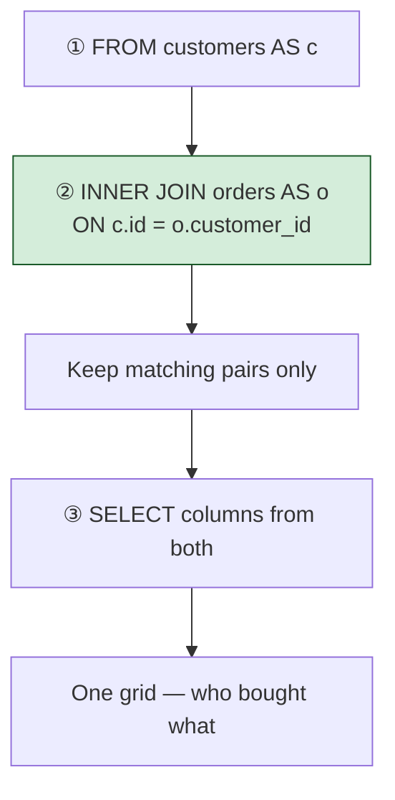
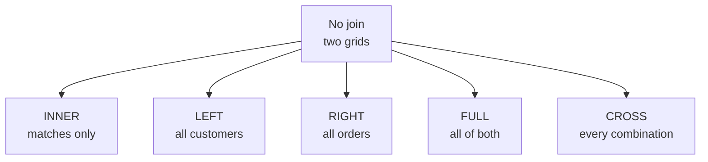

# Combine tables with joins

[← All topics](../README.md)

A **join** puts columns from **two (or more) tables into one result**, matching rows that belong together. This folder starts with **no join** — two separate queries, two separate grids — then one `.sql` file per join type. **INNER JOIN** is the first join: keep only rows that match on both sides.

---

## Visual cheat sheet — no join vs a join

Without a join you **read each table on its own**. With a join you **stitch them** using a shared key (usually `customers.id` = `orders.customer_id`).

| Term | Short definition |
| --- | --- |
| No join | Two `SELECT`s → **two result sets**. Tables are not combined. |
| Join | One `SELECT` with `JOIN` → **one result**. Columns from both tables sit on the same row. |
| Key | The column that says “this order belongs to that customer” |
| Left table | The table named in `FROM` |
| Right table | The table named after `JOIN` |

**Memory hook:** No join = **N**ot glued. Two windows. A join = **one** window, extra columns.



---

## Visual cheat sheet — no join (two results)

`no-join.sql` runs **two independent queries**. SQL Server returns **two grids**. Nothing is matched. Nothing is filtered by the other table.

| Term | Short definition |
| --- | --- |
| Two statements | Two `SELECT`s, two result tabs in SSMS |
| `SELECT * FROM customers` | Every customer column, every customer row |
| `SELECT * FROM orders` | Every order column, every order row |
| No `ON` clause | No rule that ties a customer to an order |

### What you type (from `no-join.sql`)

```sql
/* Retrieve all the data from customers and orders
   in two different results */

SELECT *
FROM customers;

SELECT *
FROM orders;
```

### What actually happens

```
┌──────────────────────────────────────────────────────────────────┐
│  QUERY 1   FROM customers → SELECT *                             │
│            ↓  result set A  (customers only)                     │
│                                                                  │
│  QUERY 2   FROM orders → SELECT *                                │
│            ↓  result set B  (orders only)                        │
│                                                                  │
│  NOT A JOIN  no matching, no extra columns, no dropped rows      │
└──────────────────────────────────────────────────────────────────┘
```

The second statement does **not** see the first. Order of the two queries only changes which grid appears first.

**Memory hook:** Two `SELECT`s = **two** answers. A join is still **one** `SELECT`.



### Two-grid picture — `no-join.sql`

```
  Result 1 — customers              Result 2 — orders
  ┌────┬───────────┬─────────┐      ┌────┬─────────────┬────────────┐
  │ id │ first_name│ country │      │ id │ customer_id │ order_date │
  │  1 │ Maria     │ Germany │      │  1 │           1 │ 2024-01-10 │
  │  2 │ Max       │ USA     │      │  2 │           1 │ 2024-02-03 │
  │  3 │ Ann       │ UK      │      │  3 │           2 │ 2024-03-15 │
  └────┴───────────┴─────────┘      └────┴─────────────┴────────────┘
  you see people                    you see orders
  you do not see who bought what in one row
```

Maria’s orders exist in grid 2 (`customer_id = 1`), but grid 1 never shows `order_date`. You must look with your eyes across two results.

### What you **cannot** do with no join

| Goal | No join | A join (later file) |
| --- | --- | --- |
| List every customer | ✓ `SELECT * FROM customers` | ✓ (and more columns) |
| List every order | ✓ `SELECT * FROM orders` | ✓ |
| Customer name **and** their order on **one row** | ✗ two grids | ✓ `INNER JOIN … ON` |
| Customers who never ordered | ✓ still in grid 1 | ✗ dropped by INNER JOIN |

**Rule:** need one combined grid → use a join. Need two independent lists → two `SELECT`s (this file).

---

## Visual cheat sheet — `INNER JOIN` (matches only)

`INNER JOIN` builds **one result**. It keeps a pair of rows only when the `ON` key matches on **both** sides. Customers with no orders disappear. Orders with no matching customer disappear.

| Term | Short definition |
| --- | --- |
| `INNER JOIN` | Combine tables; keep **matching** rows only |
| `ON a = b` | The match rule (here: customer id = order’s `customer_id`) |
| Left table | Named in `FROM` |
| Right table | Named after `JOIN` |
| Alias | Short name for a table (`customers AS c`) |
| Qualify | `c.id` / `o.order_id` — say **which** table the column is from |
| Filter effect | No match → row is gone. INNER JOIN **combines and filters**. |

For `INNER JOIN`, **table order does not matter**. `FROM customers JOIN orders` and `FROM orders JOIN customers` return the same matches (column order in `SELECT` still follows what you list).

### What you type (best practice from `inner-join.sql`)

```sql
SELECT
    c.id,
    c.first_name,
    o.order_id,
    o.sales
FROM customers AS c
INNER JOIN orders AS o
    ON c.id = o.customer_id;
```

Same matches, tables swapped — still INNER:

```sql
SELECT
    c.id,
    c.first_name,
    o.order_id,
    o.sales
FROM orders AS o
INNER JOIN customers AS c
    ON c.id = o.customer_id;
```

### What actually happens

```
┌──────────────────────────────────────────────────────────────────┐
│  STEP 1   FROM customers AS c                                    │
│           ↓  load customers                                      │
│                                                                  │
│  STEP 2   INNER JOIN orders AS o                                 │
│           ON c.id = o.customer_id                                │
│           ↓  keep only pairs that match  ← FILTER + COMBINE      │
│                                                                  │
│  STEP 3   SELECT c.id, c.first_name, o.order_id, o.sales         │
│           ↓  one row per matching pair                           │
└──────────────────────────────────────────────────────────────────┘
```

**Memory hook:** **INNER** = **IN** both tables. No partner → not in the result.



### Match picture — only customers who ordered

```
  customers              orders                    INNER JOIN result
  ┌────┬───────┐         ┌──────────┬─────┬──────┐ ┌────┬───────┬──────────┬───────┐
  │  1 │ Maria │ ●───────│ order 10 │  1  │  90  │ │  1 │ Maria │       10 │    90 │
  │  1 │ Maria │ ●───────│ order 11 │  1  │  40  │ │  1 │ Maria │       11 │    40 │
  │  2 │ Max   │ ●───────│ order 12 │  2  │  15  │ │  2 │ Max   │       12 │    15 │
  │  3 │ Ann   │    ✗    │          │     │      │ └────┴───────┴──────────┴───────┘
  └────┴───────┘         │ order 99 │ 99  │  50  │ Ann gone (no order)
                         └──────────┴─────┴──────┘ order 99 gone (no customer)
  one customer × two orders → two result rows (Maria twice)
```

Ann never ordered → dropped. Order `99` has no customer → dropped. Maria ordered twice → **two rows** (that is normal).

### Why not `SELECT *` — `id` twice

```sql
SELECT *
FROM customers
INNER JOIN orders
    ON id = customer_id;   -- ambiguous: both tables have id
```

| Problem | Why it hurts |
| --- | --- |
| `SELECT *` | Every column from **both** tables — `id` appears twice |
| `ON id = customer_id` | SQL Server does not know whose `id` you mean |
| Long names | `customers.first_name` is clear but noisy |

**Habit:** pick the columns you need. Qualify them. Alias the tables.

```sql
SELECT
    customers.id,
    customers.first_name,
    orders.order_id,
    orders.sales
FROM customers
INNER JOIN orders
    ON customers.id = orders.customer_id;
```

Then shorten with aliases (`AS c`, `AS o`) — same query, easier to read.

### Examples from `inner-join.sql`

| Goal | What to write |
| --- | --- |
| Customers **who have** an order | `FROM customers AS c INNER JOIN orders AS o ON c.id = o.customer_id` |
| Name + order id + sales | `SELECT c.id, c.first_name, o.order_id, o.sales` |
| Same matches, `orders` first | `FROM orders AS o INNER JOIN customers AS c ON …` (order of tables does not matter) |
| Avoid duplicate `id` | Do **not** `SELECT *`; list `c.id`, `o.order_id` |

**Rule:** INNER JOIN answers “who has a match?” One result row per matching **pair**, not per customer.

---

## Visual cheat sheet — join family (files to add)

Each join **starts from the same two tables** and keeps a different set of rows. Add one `.sql` file per type; add a matching cheat sheet in this README when you do.

```
  customers          orders
  ● 1 Maria          ● order for 1
  ● 2 Max            ● order for 1
  ● 3 Ann            ● order for 2
                     ● order for 99  ← no matching customer

            match on customers.id = orders.customer_id
```

| Join | Keeps | Typical file to add |
| --- | --- | --- |
| **No join** | Two separate results — nothing matched | [no-join.sql](no-join.sql) |
| **INNER JOIN** | Only rows that **match** on both sides | [inner-join.sql](inner-join.sql) |
| **LEFT JOIN** | All left rows + matches (unmatched left → `NULL` on the right) | `left-join.sql` |
| **RIGHT JOIN** | All right rows + matches (unmatched right → `NULL` on the left) | `right-join.sql` |
| **FULL JOIN** | All rows from **both**; `NULL` where there is no match | `full-join.sql` |
| **CROSS JOIN** | Every left row paired with **every** right row (no `ON`) | `cross-join.sql` |



**Memory hook:** Learn **no join** first so you can see what each join **adds**: extra columns, and a rule for which rows survive.

When you add a file, extend **Files in this folder** and drop in a new “Visual cheat sheet” section under that join’s name — same pattern as this page.

---

## Files in this folder

| File | What it covers |
| --- | --- |
| [no-join.sql](no-join.sql) | Two `SELECT`s — customers and orders as **separate** results |
| [inner-join.sql](inner-join.sql) | `INNER JOIN` — matching rows only; aliases; table order does not matter |

---

## Quick reminders

- **Two `SELECT`s** — two result sets. That is **no join**.
- **`INNER JOIN … ON c.id = o.customer_id`** — one result; **matches only**. No order → customer dropped. No customer → order dropped.
- **One customer, two orders** — two result rows (one per pair).
- **Table order does not matter** for `INNER JOIN`. Column list in `SELECT` still does.
- **Aliases** — `FROM customers AS c INNER JOIN orders AS o`. Qualify columns (`c.id`, `o.sales`).
- **Do not `SELECT *`** — both tables have `id`; pick the columns you need.
- **`ON id = customer_id`** is ambiguous. Write `c.id = o.customer_id`.
- **LEFT** / **RIGHT** = keep that side even without a match. **FULL** = keep both sides. **CROSS** = every pairing.
- Add **one `.sql` file per join**, then a cheat sheet for that file on this page.
