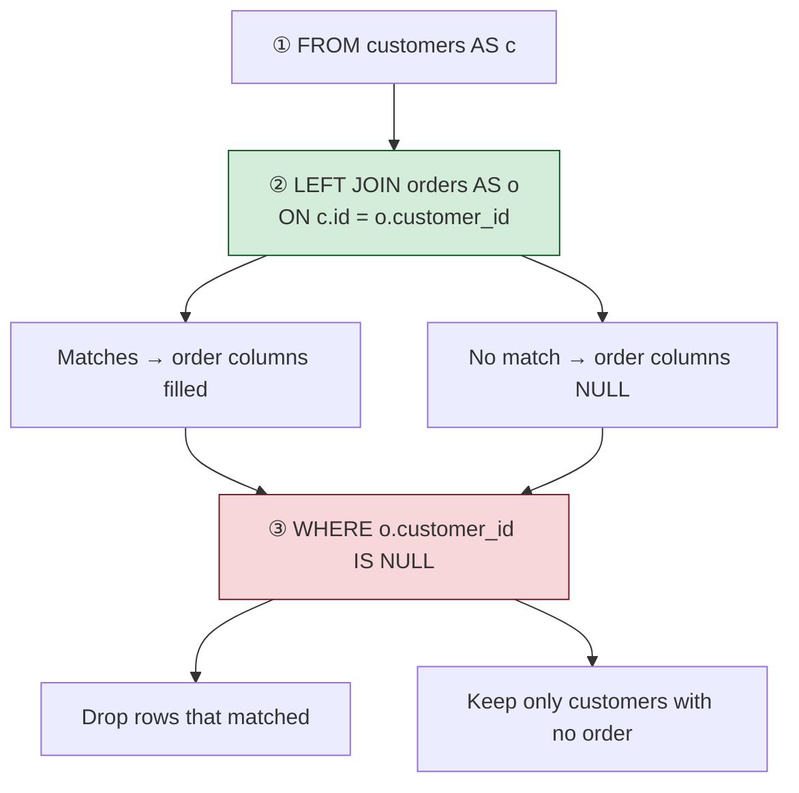
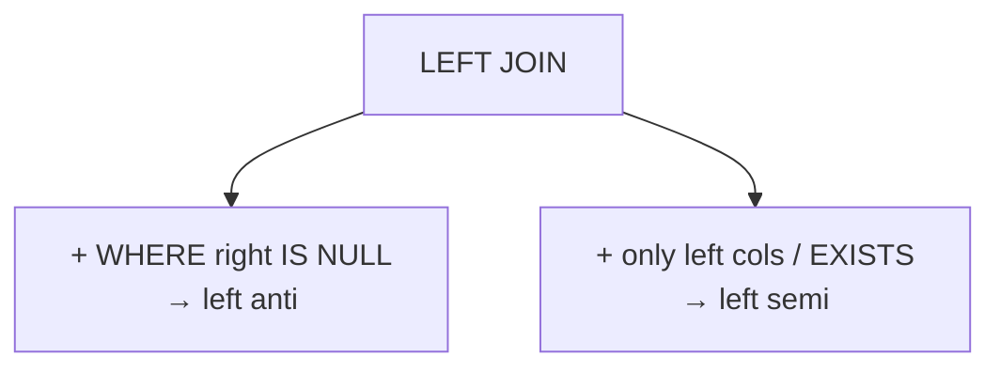

# Advanced join types

[← Joins overview](../README.md) · [← All topics](../../README.md)

These patterns build on `LEFT` / `RIGHT` / `FULL`. They are mostly **filters** — keep rows that **do** or **do not** have a match — not “glue all the columns together” queries. One `.sql` file per pattern as you add them.

---

## Visual cheat sheet — left anti join (no match on the right)

A **left anti join** keeps rows from the **left** table that have **no partner** on the right. In SQL Server there is no `ANTI JOIN` keyword. You write a `LEFT JOIN`, then keep only the padded rows with `WHERE right_key IS NULL`.

| Term | Short definition |
| --- | --- |
| Left anti join | Left rows with **no** match on the right |
| `LEFT JOIN` | Start with all left rows; unmatched get `NULL` on the right |
| `WHERE o.customer_id IS NULL` | Keep only those padded rows — the ones with **no** order |
| Filter, not enrich | Goal is “who is missing?”, not “show order details” |
| vs LEFT JOIN | LEFT keeps matches **and** non-matches; anti keeps **only** non-matches |

**Memory hook:** **Anti** = **against** a match. LEFT + `IS NULL` on the right key.



### What you type (from `left-anti-join.sql`)

```sql
SELECT *
FROM customers AS c
LEFT JOIN orders AS o
    ON c.id = o.customer_id;
```

That is the `LEFT JOIN` half. To finish a **left anti join**, keep only rows with no match:

```sql
SELECT *
FROM customers AS c
LEFT JOIN orders AS o
    ON c.id = o.customer_id
WHERE o.customer_id IS NULL;
```

Prefer selecting **left** columns only once you add the filter. Right columns are `NULL` on every surviving row — they add no data.

### What actually happens

```
┌──────────────────────────────────────────────────────────────────┐
│  STEP 1   FROM customers AS c                                    │
│           ↓  all customers                                       │
│                                                                  │
│  STEP 2   LEFT JOIN orders AS o ON c.id = o.customer_id          │
│           ↓  attach orders; else NULL  ← same as LEFT JOIN       │
│                                                                  │
│  STEP 3   WHERE o.customer_id IS NULL                            │
│           ↓  drop anyone who got an order  ← ANTI FILTER HERE    │
│                                                                  │
│  RESULT   customers who never ordered                            │
└──────────────────────────────────────────────────────────────────┘
```

Without `WHERE … IS NULL`, this is a normal LEFT JOIN (Ann stays **and** Maria/Max stay). The `WHERE` is what makes it **anti**.

### Anti picture — only Ann

```
  after LEFT JOIN                         after WHERE o.customer_id IS NULL
  ┌────┬───────┬──────────┐               ┌────┬───────┐
  │  1 │ Maria │ order 10 │ ✗ drop        │  3 │ Ann   │  ← only non-match
  │  1 │ Maria │ order 11 │ ✗ drop        └────┴───────┘
  │  2 │ Max   │ order 12 │ ✗ drop
  │  3 │ Ann   │   NULL   │ ✓ keep
  └────┴───────┴──────────┘
```

Maria and Max matched → gone. Ann had `NULL` on the right → kept. Order `99` never appears (it was never on the left).

### LEFT JOIN vs left anti join

| | `LEFT JOIN` only | Left anti (`LEFT` + `WHERE right IS NULL`) |
| --- | --- | --- |
| Maria with orders | ✓ (with order columns) | ✗ |
| Ann with no order | ✓ (`NULL` order) | ✓ |
| Question answered | “all customers + orders if any” | “customers with **no** orders” |

### Which column in `IS NULL`?

Any column from the **right** table that is `NOT NULL` when a match exists works — usually the join key or the right primary key:

| Filter | Why it works |
| --- | --- |
| `WHERE o.customer_id IS NULL` | Join key empty → no match |
| `WHERE o.order_id IS NULL` | Same idea if `order_id` is always present on real orders |

Do **not** use a left-table column (`WHERE c.id IS NULL`) — left rows always have `c.id`.

### Examples from `left-anti-join.sql`

| Goal | What to write |
| --- | --- |
| Start with all customers + orders | `LEFT JOIN orders … ON c.id = o.customer_id` (as in the file) |
| Only customers who never ordered | Add `WHERE o.customer_id IS NULL` |
| Show only customer fields | `SELECT c.id, c.first_name` (optional once you filter) |

**Rule:** left anti join = “who on the left is **missing** from the right?” `LEFT JOIN` finds the gaps; `WHERE … IS NULL` keeps only the gaps.

---

## Advanced family (files to add)

| Pattern | Keeps | Typical file |
| --- | --- | --- |
| **Left anti join** | Left rows with **no** right match | [left-anti-join.sql](left-anti-join.sql) |
| **Right anti join** | Right rows with **no** left match | `right-anti-join.sql` |
| **Left semi join** | Left rows that **have** a right match (left columns only) | `left-semi-join.sql` |



When you add a file, extend **Files in this folder** and add a cheat sheet section — same pattern as this page.

---

## Files in this folder

| File | What it covers |
| --- | --- |
| [left-anti-join.sql](left-anti-join.sql) | Left anti join setup — `LEFT JOIN` for “customers with no orders”; add `WHERE` right key `IS NULL` to keep only non-matches |

---

## Quick reminders

- **Left anti** — left rows with **no** match. Not a separate SQL keyword in SQL Server.
- **Pattern:** `LEFT JOIN` … `WHERE right_key IS NULL`.
- **Purpose:** filter / look-up (“who is missing?”), not to pull right-table data.
- **`SELECT` left columns** — right side is `NULL` on every kept row.
- Test with `IS NULL`, never `= NULL`.
- **LEFT JOIN** alone keeps matches too. Drop the anti filter and you are back to a normal left join.
