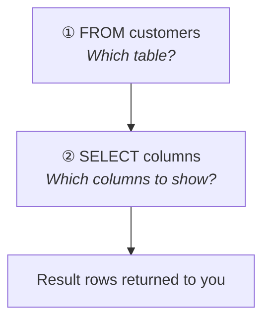
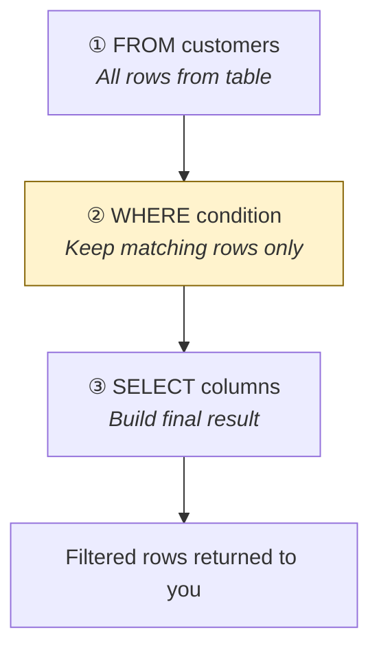
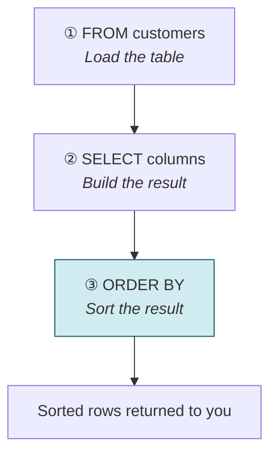
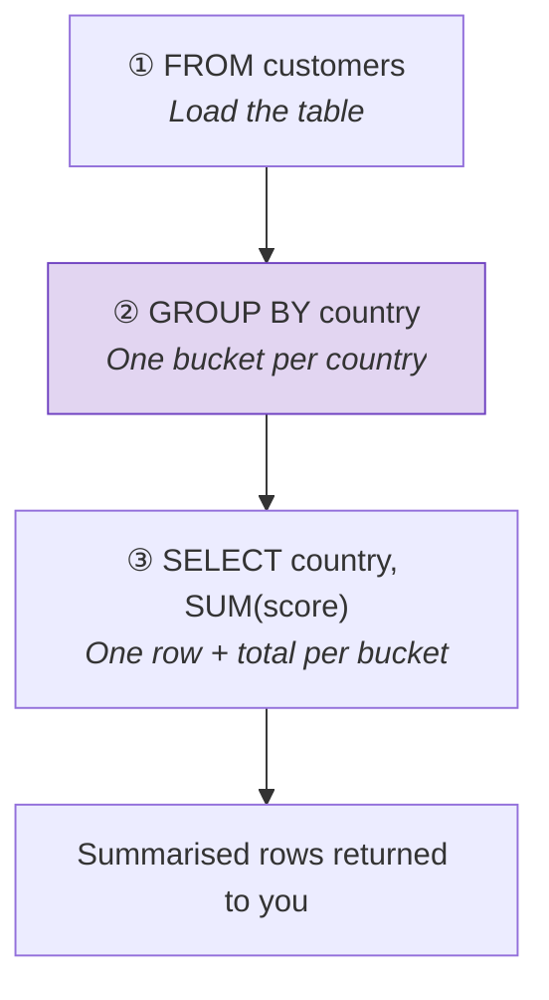

# Query data with SELECT

[← All topics](../README.md)

First topic: choose a database, write comments, retrieve rows with `SELECT` / `FROM`, filter with `WHERE`, sort with `ORDER BY`, and summarise with `GROUP BY`.

---

## Visual cheat sheet — `SELECT` / `FROM` (no filter)

You **write** SQL top-to-bottom, but SQL Server **runs** it in a different order.  
Forgetting this is why `WHERE score > 100` works even though `score` appears in `SELECT` — the engine already knows the column from `FROM` before it builds the result list.

### What you type (reading order)

```sql
SELECT first_name, country, score   -- ① you write this first
FROM customers;                     -- ② you write this second
```

### What actually runs (execution order)

```
┌─────────────────────────────────────────────────────────┐
│  STEP 1   FROM customers          ← find the table      │
│           ↓                                             │
│  STEP 2   SELECT first_name,      ← pick columns        │
│           country, score          (build result set)    │
└─────────────────────────────────────────────────────────┘
```

**Memory hook:** **F**rom first, **S**elect second — **F** before **S** in the alphabet, and in the engine.



---

## Full clause order (save for later topics)

When you add `WHERE`, `ORDER BY`, etc., the **written** order and **execution** order diverge more:

| You write (top → bottom) | Engine runs (actual order)   |
| ------------------------ | ---------------------------- |
| `SELECT`                 | 5. `SELECT`                  |
| `FROM`                   | 1. **`FROM`** ← always first |
| `WHERE`                  | 2. `WHERE`                   |
| `GROUP BY`               | 3. `GROUP BY`                |
| `HAVING`                 | 4. `HAVING`                  |
| `ORDER BY`               | 6. `ORDER BY`                |

**One-line mnemonic:** **F**rom **W**here **G**roup **H**aving **S**elect **O**rder → **FWGHSO**

For this folder you need **FROM → WHERE → GROUP BY → SELECT → ORDER BY**. `HAVING` is next.

---

## Visual cheat sheet — `WHERE` (filter rows)

`WHERE` **narrows** the rows **before** SQL Server decides which columns to show.  
Think of it as a gate: every row from the table must pass the condition, or it is dropped.

### What you type (reading order)

```sql
SELECT *                    -- ① you write this first
FROM customers              -- ② you write this second
WHERE country = 'Germany';  -- ③ you write this third
```

### What actually runs (execution order)

```
┌──────────────────────────────────────────────────────────────────┐
│  STEP 1   FROM customers                                         │
│           ↓  load all rows from the table                        │
│                                                                  │
│  STEP 2   WHERE country = 'Germany'                              │
│           ↓  keep only rows that pass the test  ← FILTER HERE    │
│                                                                  │
│  STEP 3   SELECT *                                               │
│           ↓  pick columns from the rows that survived            │
└──────────────────────────────────────────────────────────────────┘
```

**Memory hook:** **F**rom → **W**here → **S**elect → **FWS** (filter in the middle, before you "select" what to show).



### Filter funnel (mental picture)

```
  customers table          WHERE score != 0          SELECT *
  ┌───┬───┬───┐            ┌───┬───┬───┐            ┌───┬───┬───┐
  │ A │ 0 │ ✗ │  ──────►   │   │   │   │  ──────►   │ B │85 │ ✓ │
  │ B │85 │ ✓ │            │ B │85 │ ✓ │            │ C │42 │ ✓ │
  │ C │42 │ ✓ │            │ C │42 │ ✓ │            └───┴───┴───┘
  └───┴───┴───┘            └───┴───┴───┘
  3 rows loaded              2 rows pass gate         columns picked
```

### Examples from `where-clause.sql`

| Goal | Condition | Notes |
| --- | --- | --- |
| Score is not zero | `WHERE score != 0` | `!=` means "not equal" |
| Country is Germany | `WHERE country = 'Germany'` | Text values need **single quotes** `'...'` |
| Fewer columns + filter | `SELECT first_name, country` + `WHERE country = 'Germany'` | `WHERE` still runs **before** `SELECT` |

### Common comparison operators

| Operator | Meaning | Example |
| --- | --- | --- |
| `=` | equal to | `country = 'Germany'` |
| `!=` or `<>` | not equal to | `score != 0` |
| `>` `<` `>=` `<=` | greater / less (or equal) | `score > 100` |

**Rule:** Numbers without quotes (`0`, `100`). Text with single quotes (`'Germany'`).

---

## Visual cheat sheet — `ORDER BY` (sort rows)

`ORDER BY` **sorts the finished result**. It does not filter. It does not pick columns. It runs **last**.

| Term | Short definition |
| --- | --- |
| `ORDER BY` | Sort the result set after it is built |
| `ASC` | Ascending — lowest → highest / A → Z (**default**) |
| `DESC` | Descending — highest → lowest / Z → A |
| Nested `ORDER BY` | Sort by the first column, then use the next as a **tie-breaker** |

Always write `ASC` or `DESC` even though `ASC` is the default — it is easier to read.

### What you type (reading order)

```sql
SELECT *                     -- ① you write this first
FROM customers               -- ② you write this second
ORDER BY score DESC;         -- ③ you write this last
```

### What actually runs (execution order)

```
┌──────────────────────────────────────────────────────────────────┐
│  STEP 1   FROM customers                                         │
│           ↓  load rows                                           │
│                                                                  │
│  STEP 2   SELECT *                                               │
│           ↓  pick columns (build the result)                     │
│                                                                  │
│  STEP 3   ORDER BY score DESC                                    │
│           ↓  sort that result  ← SORT HERE (last)                │
└──────────────────────────────────────────────────────────────────┘
```

**Not** `FROM` → `ORDER BY` → `SELECT`. You sort the **result**, not the table. Proof: a `SELECT` alias works in `ORDER BY` (SELECT already ran), but that same alias fails in `WHERE` (WHERE runs before SELECT).

```sql
SELECT first_name AS name
FROM customers
ORDER BY name;   -- works  → SELECT happened, then ORDER BY
```

**Memory hook:** **F**rom → **S**elect → **O**rder → **FSO**. With a filter: **F**rom → **W**here → **S**elect → **O**rder → **FWSO**.



### Sort picture — `ORDER BY score DESC`

```
  unsorted result              ORDER BY score DESC
  ┌────────┬───────┐           ┌────────┬───────┐
  │ Anna   │    42 │           │ Ben    │   100 │  ← highest first
  │ Ben    │   100 │  ──────►  │ Cara   │    85 │
  │ Cara   │    85 │           │ Anna   │    42 │  ← lowest last
  └────────┴───────┘           └────────┴───────┘
```

`ASC` is the same picture flipped: `42` then `85` then `100`.

### Nested sort — `country ASC, score DESC`

First group by country (A → Z). Then, **inside each country**, highest score first.

```
  unsorted                 ① country ASC              ② then score DESC
  ┌─────────┬─────┐        ┌─────────┬─────┐          ┌─────────┬─────┐
  │ USA     │  10 │        │ Germany │  42 │          │ Germany │  85 │
  │ Germany │  42 │  ───►  │ Germany │  85 │   ───►   │ Germany │  42 │
  │ USA     │ 100 │        │ USA     │  10 │          │ USA     │ 100 │
  │ Germany │  85 │        │ USA     │ 100 │          │ USA     │  10 │
  └─────────┴─────┘        └─────────┴─────┘          └─────────┴─────┘
                           countries grouped          tie-breaker inside group
```

### Examples from `order-by.sql`

| Goal | Clause |
| --- | --- |
| Highest score first | `ORDER BY score DESC` |
| Lowest score first | `ORDER BY score ASC` |
| Country A→Z, then highest score | `ORDER BY country ASC, score DESC` |

**Rule:** Left column is the main sort. Each extra column only breaks ties.

---

## Visual cheat sheet — `GROUP BY` (collapse rows)

`GROUP BY` **combines rows that share the same value** into one row, then **aggregates** a column for that group.

| Term | Short definition |
| --- | --- |
| `GROUP BY col` | One output row per distinct value of `col` |
| Aggregate | A calc over the group: `SUM`, `COUNT`, `AVG`, `MIN`, `MAX` |
| `SUM(score)` | Add the scores inside the group |
| `COUNT(id)` | Count customers (non-null `id`s) in the group |
| `AS alias` | Rename the result column (`total_score`) |
| Extra `GROUP BY` columns | Finer groups — each unique **pair** (country + name) |

**Golden rule:** every `SELECT` column is either in `GROUP BY` **or** inside an aggregate. `SELECT first_name` with `GROUP BY country` alone will fail.

### What you type (reading order)

```sql
SELECT
    country,            -- ① you write this first (category)
    SUM(score)          --    and the aggregate
FROM customers          -- ② you write this second
GROUP BY country;       -- ③ you write this third
```

### What actually runs (execution order)

```
┌──────────────────────────────────────────────────────────────────┐
│  STEP 1   FROM customers                                         │
│           ↓  load rows                                           │
│                                                                  │
│  STEP 2   GROUP BY country                                       │
│           ↓  bucket rows that share a country  ← GROUP HERE      │
│                                                                  │
│  STEP 3   SELECT country, SUM(score)                             │
│           ↓  one row per bucket + the total                      │
└──────────────────────────────────────────────────────────────────┘
```

`ORDER BY` still runs **after** `SELECT` if you add it. `WHERE` still runs **before** `GROUP BY` (filter rows, then group).

**Memory hook:** **F**rom → **G**roup → **S**elect → **FGS**. With a filter: **FWGSO**.



### Collapse picture — `GROUP BY country` + `SUM(score)`

```
  customers (detail)              GROUP BY country
  ┌─────────┬───────┐             ┌─────────┬────────────┐
  │ Germany │    85 │             │ Germany │  85+42=127 │  ← 1 row
  │ Germany │    42 │   ──────►   │ USA     │ 100+10=110 │  ← 1 row
  │ USA     │   100 │             └─────────┴────────────┘
  │ USA     │    10 │             many rows → few rows
  └─────────┴───────┘
```

### Two aggregates — `SUM` and `COUNT`

```
  Germany bucket                  SELECT result
  ┌─────────┬───────┐             ┌─────────┬─────────────┬─────────────────┐
  │ Germany │    85 │   ──────►   │ Germany │ total_score │ total_customers │
  │ Germany │    42 │             │         │     127     │        2        │
  └─────────┴───────┘             └─────────┴─────────────┴─────────────────┘
```

### Extra grouping column — `GROUP BY country, first_name`

Finer buckets. `Germany + Anna` and `Germany + Ben` stay **two** rows, not one.

```
  GROUP BY country                GROUP BY country, first_name
  ┌─────────┬─────┐               ┌─────────┬────────┬─────┐
  │ Germany │ 127 │   ──────►     │ Germany │ Anna   │  85 │
  │ USA     │ 110 │               │ Germany │ Ben    │  42 │
  └─────────┴─────┘               │ USA     │ Cara   │ 100 │
                                  └─────────┴────────┴─────┘
  coarse (one per country)        fine (one per country + name)
```

### Examples from `group-by.sql`

| Goal | What to write |
| --- | --- |
| Total score per country | `SELECT country, SUM(score) ... GROUP BY country` |
| Total score per country **and** name | `GROUP BY country, first_name` (both columns in `SELECT` too) |
| Score total + customer count | `SUM(score) AS total_score, COUNT(id) AS total_customers` |

**Rule:** `GROUP BY` answers “per what?” — per country, or per country and name. Aggregates answer “what number for that group?”

---

## Files in this folder

| File | What it covers |
| --- | --- |
| [usedb&comments.sql](usedb%26comments.sql) | `USE` and single-line / multi-line comments |
| [select&from.sql](select%26from.sql) | `SELECT *` and selected columns from `customers` and `orders` |
| [where-clause.sql](where-clause.sql) | Filter rows with `WHERE` (`!=`, `=`, text vs numbers) |
| [order-by.sql](order-by.sql) | Sort rows with `ORDER BY` (`ASC`, `DESC`, nested keys) |
| [group-by.sql](group-by.sql) | Collapse rows with `GROUP BY` (`SUM`, `COUNT`, extra keys) |

---

## Quick reminders

- **`USE MyDatabase;`** — tells SQL Server which database to use (run before your query).
- **`SELECT *`** — all columns; **`SELECT col1, col2`** — only the columns you list.
- **`FROM table_name`** — where the rows come from; the engine processes this **first**.
- **`WHERE condition`** — filter rows **after** `FROM`, **before** grouping.
- **`GROUP BY col`** — one row per value of `col`; pair it with `SUM` / `COUNT` (and `AS` aliases). Extra keys make finer groups.
- **`ORDER BY col ASC|DESC`** — sort the result **last**. Nested columns are tie-breakers.
- Comments: `-- one line` or `/* many lines */` — ignored by the engine, for you only.
