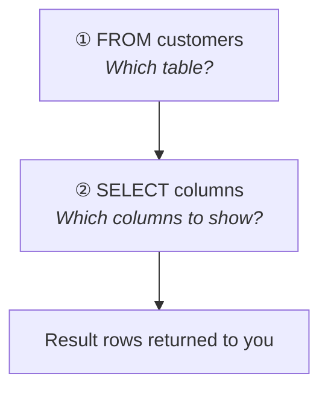
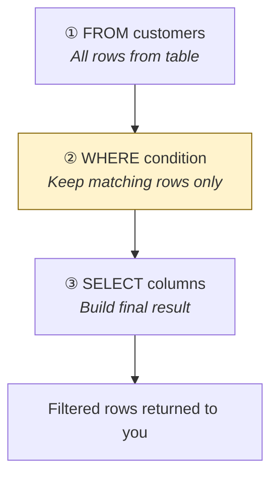

# Query data with SELECT

[← All topics](../README.md)

First topic: choose a database, write comments, retrieve rows with `SELECT` / `FROM`, and filter rows with `WHERE`.

---

## Visual cheat sheet — `SELECT` / `FROM` (no filter)

You **write** SQL top-to-bottom, but SQL Server **runs** it in a different order.  
Forgetting this is why `WHERE score > 100` works even though `score` appears in `SELECT` — the engine already knows the column from `FROM` before it builds the result list.

### What you type (reading order)

```sql
SELECT first_name, country, score   -- ① you write this first
FROM customers;                     -- ② you write this second
```

### What actually runs (execution order)

```
┌─────────────────────────────────────────────────────────┐
│  STEP 1   FROM customers          ← find the table      │
│           ↓                                             │
│  STEP 2   SELECT first_name,      ← pick columns        │
│           country, score          (build result set)    │
└─────────────────────────────────────────────────────────┘
```

**Memory hook:** **F**rom first, **S**elect second — **F** before **S** in the alphabet, and in the engine.



---

## Full clause order (save for later topics)

When you add `WHERE`, `ORDER BY`, etc., the **written** order and **execution** order diverge more:

| You write (top → bottom) | Engine runs (actual order)   |
| ------------------------ | ---------------------------- |
| `SELECT`                 | 5. `SELECT`                  |
| `FROM`                   | 1. **`FROM`** ← always first |
| `WHERE`                  | 2. `WHERE`                   |
| `GROUP BY`               | 3. `GROUP BY`                |
| `HAVING`                 | 4. `HAVING`                  |
| `ORDER BY`               | 6. `ORDER BY`                |

**One-line mnemonic:** **F**rom **W**here **G**roup **H**aving **S**elect **O**rder → **FWGHSO**

For this folder you need **FROM → WHERE → SELECT**. The rest will matter in later lessons.

---

## Visual cheat sheet — `WHERE` (filter rows)

`WHERE` **narrows** the rows **before** SQL Server decides which columns to show.  
Think of it as a gate: every row from the table must pass the condition, or it is dropped.

### What you type (reading order)

```sql
SELECT *                    -- ① you write this first
FROM customers              -- ② you write this second
WHERE country = 'Germany';  -- ③ you write this third
```

### What actually runs (execution order)

```
┌──────────────────────────────────────────────────────────────────┐
│  STEP 1   FROM customers                                         │
│           ↓  load all rows from the table                        │
│                                                                  │
│  STEP 2   WHERE country = 'Germany'                              │
│           ↓  keep only rows that pass the test  ← FILTER HERE    │
│                                                                  │
│  STEP 3   SELECT *                                               │
│           ↓  pick columns from the rows that survived            │
└──────────────────────────────────────────────────────────────────┘
```

**Memory hook:** **F**rom → **W**here → **S**elect → **FWS** (filter in the middle, before you "select" what to show).



### Filter funnel (mental picture)

```
  customers table          WHERE score != 0          SELECT *
  ┌───┬───┬───┐            ┌───┬───┬───┐            ┌───┬───┬───┐
  │ A │ 0 │ ✗ │  ──────►   │   │   │   │  ──────►   │ B │85 │ ✓ │
  │ B │85 │ ✓ │            │ B │85 │ ✓ │            │ C │42 │ ✓ │
  │ C │42 │ ✓ │            │ C │42 │ ✓ │            └───┴───┴───┘
  └───┴───┴───┘            └───┴───┴───┘
  3 rows loaded              2 rows pass gate         columns picked
```

### Examples from `where-clause.sql`

| Goal | Condition | Notes |
| --- | --- | --- |
| Score is not zero | `WHERE score != 0` | `!=` means "not equal" |
| Country is Germany | `WHERE country = 'Germany'` | Text values need **single quotes** `'...'` |
| Fewer columns + filter | `SELECT first_name, country` + `WHERE country = 'Germany'` | `WHERE` still runs **before** `SELECT` |

### Common comparison operators

| Operator | Meaning | Example |
| --- | --- | --- |
| `=` | equal to | `country = 'Germany'` |
| `!=` or `<>` | not equal to | `score != 0` |
| `>` `<` `>=` `<=` | greater / less (or equal) | `score > 100` |

**Rule:** Numbers without quotes (`0`, `100`). Text with single quotes (`'Germany'`).

---

## Files in this folder

| File | What it covers |
| --- | --- |
| [usedb&comments.sql](usedb%26comments.sql) | `USE` and single-line / multi-line comments |
| [select&from.sql](select%26from.sql) | `SELECT *` and selected columns from `customers` and `orders` |
| [where-clause.sql](where-clause.sql) | Filter rows with `WHERE` (`!=`, `=`, text vs numbers) |

---

## Quick reminders

- **`USE MyDatabase;`** — tells SQL Server which database to use (run before your query).
- **`SELECT *`** — all columns; **`SELECT col1, col2`** — only the columns you list.
- **`FROM table_name`** — where the rows come from; the engine processes this **first**.
- **`WHERE condition`** — filter rows **second** (after `FROM`, before `SELECT`).
- Comments: `-- one line` or `/* many lines */` — ignored by the engine, for you only.
