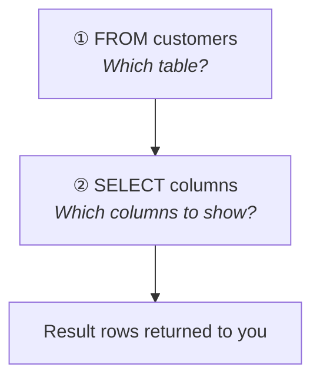

# Query data with SELECT

[← All topics](../README.md)

First topic: choose a database, write comments, and retrieve rows with `SELECT` / `FROM`.

---

## Visual cheat sheet — read vs run order

You **write** SQL top-to-bottom, but SQL Server **runs** it in a different order.  
Forgetting this is why `WHERE score > 100` works even though `score` appears in `SELECT` — the engine already knows the column from `FROM` before it builds the result list.

### What you type (reading order)

```sql
SELECT first_name, country, score   -- ① you write this first
FROM customers;                     -- ② you write this second
```

### What actually runs (execution order)

```
┌─────────────────────────────────────────────────────────┐
│  STEP 1   FROM customers          ← find the table      │
│           ↓                                             │
│  STEP 2   SELECT first_name,      ← pick columns        │
│           country, score          (build result set)    │
└─────────────────────────────────────────────────────────┘
```

**Memory hook:** **F**rom first, **S**elect second — **F** before **S** in the alphabet, and in the engine.



---

## Full clause order (save for later topics)

When you add `WHERE`, `ORDER BY`, etc., the **written** order and **execution** order diverge more:

| You write (top → bottom) | Engine runs (actual order)   |
| ------------------------ | ---------------------------- |
| `SELECT`                 | 5. `SELECT`                  |
| `FROM`                   | 1. **`FROM`** ← always first |
| `WHERE`                  | 2. `WHERE`                   |
| `GROUP BY`               | 3. `GROUP BY`                |
| `HAVING`                 | 4. `HAVING`                  |
| `ORDER BY`               | 6. `ORDER BY`                |

**One-line mnemonic:** **F**rom **W**here **G**roup **H**aving **S**elect **O**rder → **FWGHSO**

For this folder you only need **FROM → SELECT**. The rest will matter in later lessons.

---

## Files in this folder

| File | What it covers |
| --- | --- |
| [usedb&comments.sql](usedb%26comments.sql) | `USE` and single-line / multi-line comments |
| [select&from.sql](select%26from.sql) | `SELECT *` and selected columns from `customers` and `orders` |

---

## Quick reminders

- **`USE MyDatabase;`** — tells SQL Server which database to use (run before your query).
- **`SELECT *`** — all columns; **`SELECT col1, col2`** — only the columns you list.
- **`FROM table_name`** — where the rows come from; the engine processes this **before** `SELECT`.
- Comments: `-- one line` or `/* many lines */` — ignored by the engine, for you only.
